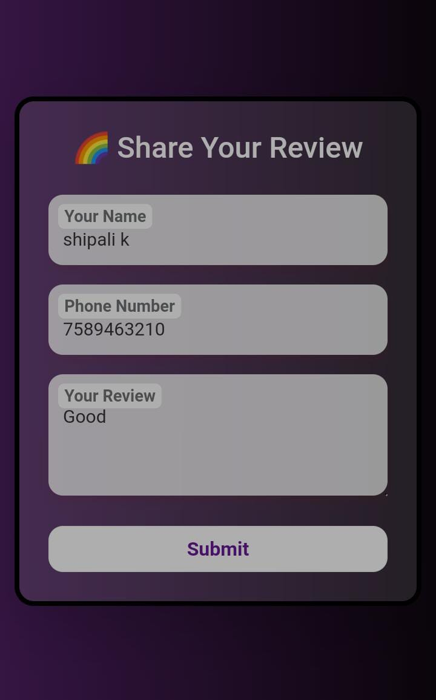
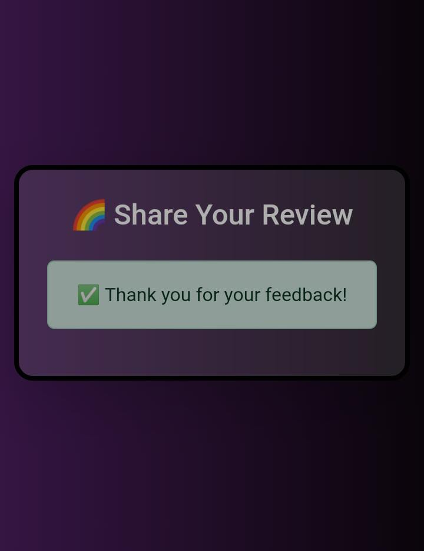
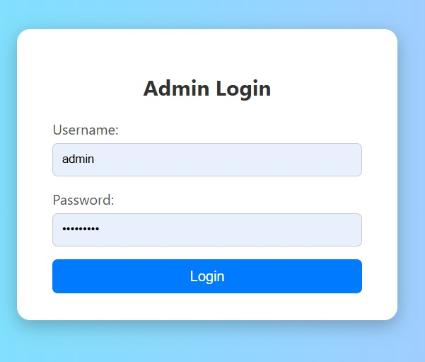

🏨Lodge Review System

A Django-based web application that allows guests at a lodge to submit reviews using a QR code. Admins can securely log in using a custom login form to view feedback in a dedicated dashboard.

📌 Features

- ✅ Scan QR code to access mobile-friendly review form.
- ✅ Collect Name, Phone Number, and Review.
- ✅ Show thank-you message on submission.
- ✅ Admin login using custom login form.
- ✅ Admin dashboard to view all submitted reviews
- ✅ Hosted on Render

🛠 Tech Stack

- Python 
- Django 
- HTML5, CSS3,Bootstrap 
- qrcode module for QR generation
- SQLite(for local development)
- PostgreSQL(used or recommended for deployment on Render)

📸 Screenshots

📱 Review Form

🙏 Thank You Page

🔐 Admin Login

📊 Admin Dashboard

